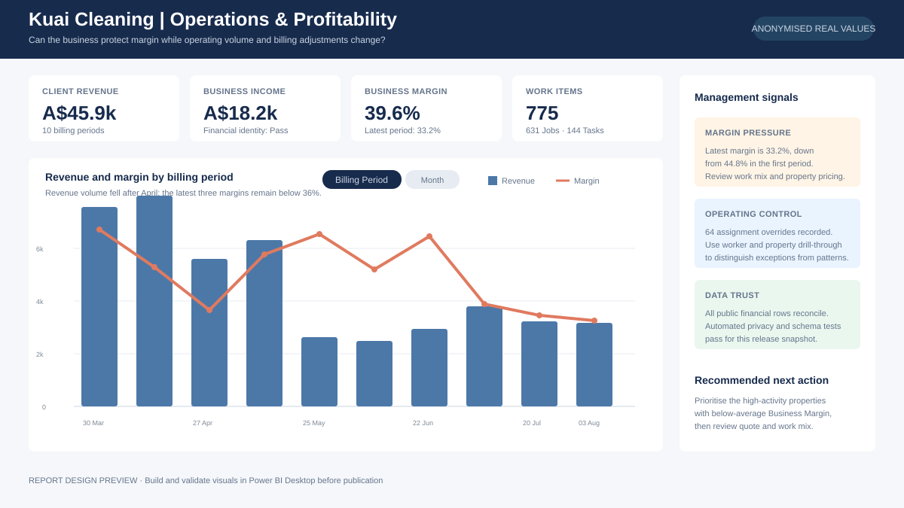
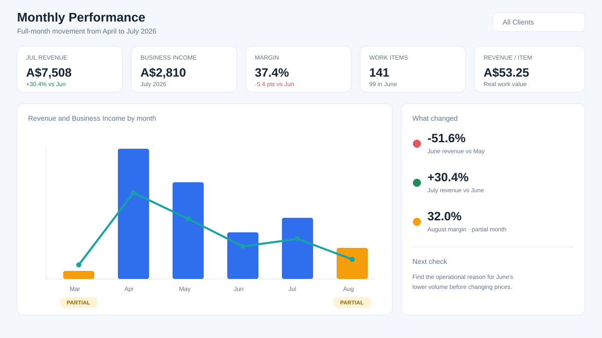
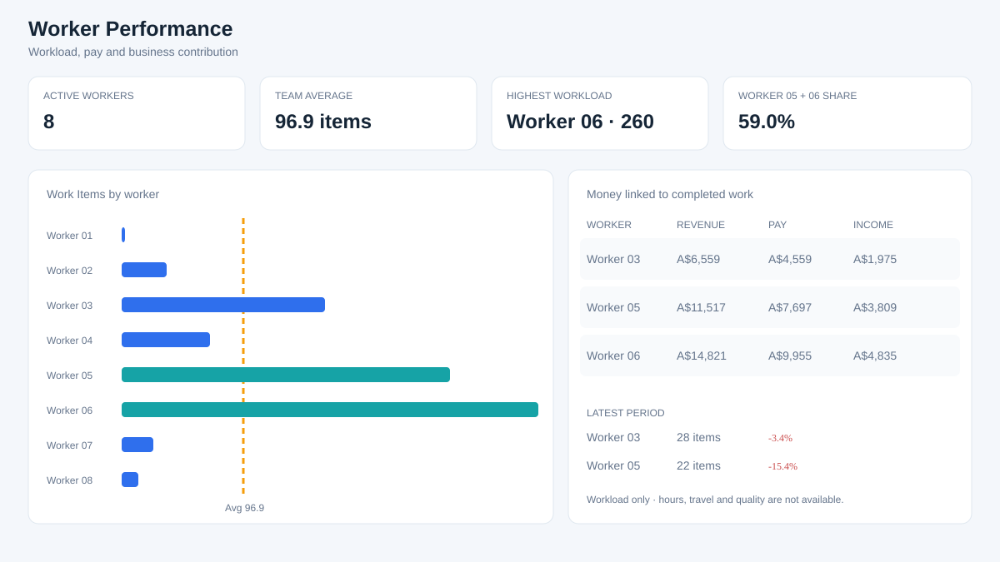
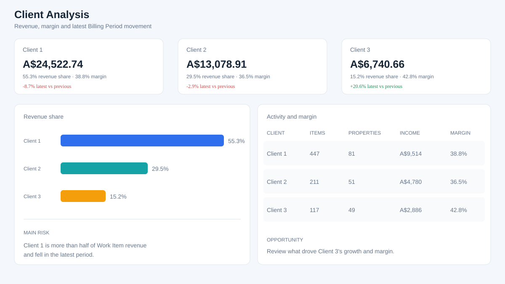
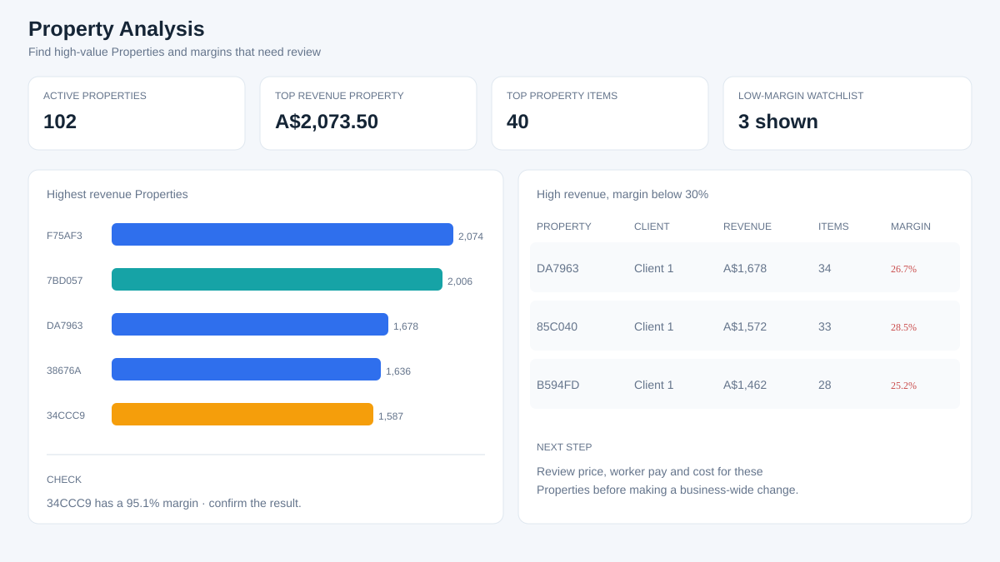

# Kuai Cleaning Business Dashboard

This project shows how I turned exports from a cleaning-business system into a Power BI dashboard that answers everyday business questions:

- Is the business making enough money?
- Is the latest billing period better or worse than the one before it?
- How much work did each worker complete, and how does that compare with the team average?
- Which Clients and Properties bring in the most revenue?
- Are manual adjustments hiding an otherwise healthy result?

The dates and financial values in this repository are real. Names, addresses, free text and original IDs were removed. The business has three Clients, shown as Client 1, Client 2 and Client 3.



The image is a design preview. The data preparation, Power Query, DAX, report plan and tests are ready, but the final PBIP still needs to be built and checked in Power BI Desktop on Windows.

## What the public sample shows

The sample contains ten closed 14-day billing periods, 775 Jobs and Tasks, 41 manual adjustments, eight anonymous workers and 102 anonymous properties.

The latest billing period compared with the previous one shows:

- revenue down **2.0%**;
- work items down **6.5%**;
- Business Income down **3.3%**;
- margin down **0.4 percentage points**, from 33.6% to 33.2%;
- average revenue per work item up from **A$52.01 to A$53.64**;
- average Business Income per work item up from **A$18.15 to A$19.60**.

That means the latest result is not simply “fewer jobs and worse work”. Normal work became slightly more valuable per item. The larger issue was manual adjustments: their Business Income impact moved from **-A$40.00 to -A$87.50**.

Work is also concentrated. Worker 06 completed 260 items and Worker 05 completed 197. Together they handled about 59% of all Work Items, while the average across active workers was 96.9.

Read the full [business insight summary](docs/business-insights.md).

## How Client names are handled

The business has three Clients. Their public names are Client 1, Client 2 and Client 3. All money and dates remain real.

## How time works in the dashboard

The main view uses the business's closed 14-day Billing Period. This matches how billing is actually managed and makes the “compared with previous” numbers clear.

A Month option is also available for a broader view. March and August are partial months, so they are labelled as partial rather than being compared as if they were complete.

## What I built

- Python scripts that create and check the public sample;
- Power Query for the public model and the private folder-import pattern;
- a Power BI model with Work Items, manual adjustments and property snapshots kept at the right level;
- more than 60 DAX measures covering money, monthly movement, workers, Clients and previous-period changes;
- nine report pages with one clear business question per page;
- automated checks for missing files, duplicate IDs, financial balancing, private information and broken links.

Every code file uses short comments to explain each logical block.

## Dashboard pages

1. **Business Overview** — latest result and the main reason for change.
2. **Monthly Performance** — full-month trend, margin and average value.
3. **Billing Period Trend** — each closed 14-day result.
4. **Worker Performance** — workload, pay, team average and recent change.
5. **Client Analysis** — revenue share, margin and recent change.
6. **Property Analysis** — high-revenue and low-margin Properties.
7. **Jobs and Tasks** — work mix and average value.
8. **Billing and Adjustments** — one-off entries and overrides.
9. **Billing Checks** — financial balance and records to review.









See the [report plan](docs/report-specification.md) for the exact visuals and interactions.

## Project folders

```text
data/sample/                  public CSVs and calculated insight summaries
scripts/                      Python data preparation and privacy checks
tests/                        Python project checks
power-query/public-model/     queries that load the public sample
power-query/private-pipeline/ examples for importing the real period files
dax/                          measures, time selector and model tests
docs/                         business findings and build decisions
powerbi/                      model plan and Desktop build guide
images/                       report design previews
```

## Rebuild the public sample

Private files stay outside the repository. Pass their folder to the Python script:

```bash
# Create anonymised portfolio data while keeping real dates and amounts.
python3 scripts/build_public_dataset.py /path/to/private/files data/sample

# Check the public files before sharing them.
python3 scripts/validate_public_dataset.py data/sample

# Check the complete project.
python3 tests/verify_portfolio.py
```

## Build the Power BI report

Follow [Build the report in Power BI Desktop](powerbi/BUILD_IN_POWER_BI.md). It explains the queries, table links, measure formats, time selector, pages and final checks without assuming prior knowledge of this project.

## Current status

- Public data build: **passed**
- Privacy and financial checks: **passed**
- Power Query and DAX: **written, awaiting Power BI Desktop run**
- PBIP report pages: **not yet built or visually checked**

I keep this distinction visible because a design should not be described as a finished Power BI report until it has opened, refreshed and passed its tests in Desktop.
