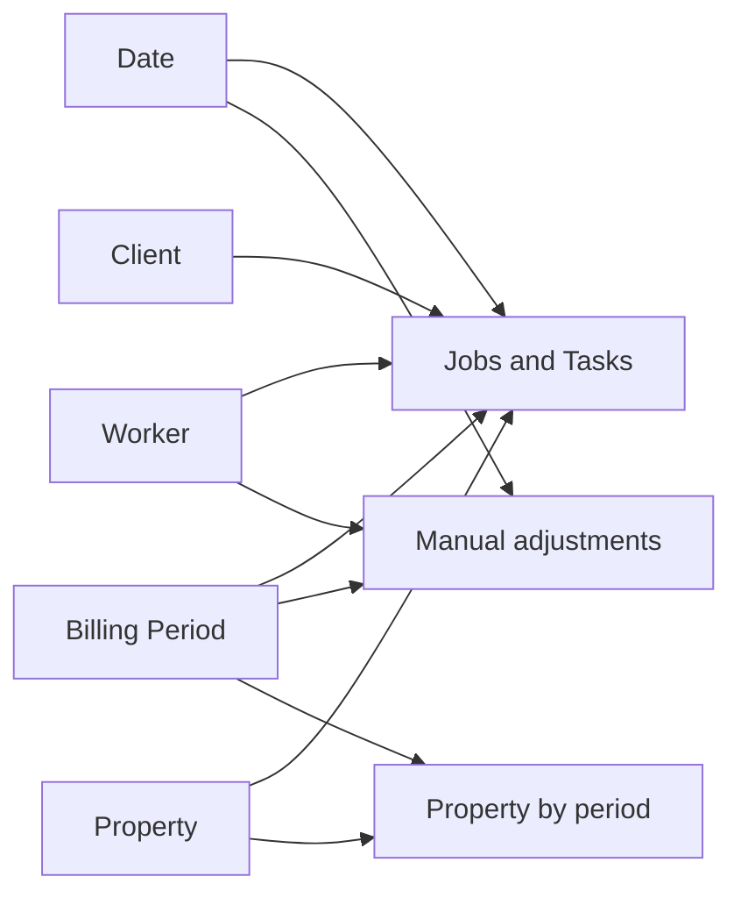

# How the tables fit together

The source files look similar, but they do not all describe the same thing. Keeping that difference clear prevents double counting.

## The simple picture

## What each main table represents

### Jobs and Tasks

`FactWorkItem` has one row for one Job or one Task. Jobs and Tasks use the same source columns, so they are combined and marked with `Work Item Type`.

This is where most revenue, worker pay, cost and Business Income come from.

### Manual adjustments

`FactManualEntry` has one row for one manual adjustment. It stays separate because an adjustment is not always a service visit. It may be extra income, extra pay, a correction or a reversal.

The money measures add active adjustments to the Work Item result.

### Property by Billing Period

`FactPropertyPeriodSnapshot` has one row for one Property in one Billing Period. A Property appears again in later periods, so this table cannot be treated as a simple one-row-per-Property list.

The table holds the quote and activity seen in that period.

## The supporting tables

- `DimDate` supplies days, weeks and months.
- `DimBillingPeriod` supplies the closed 14-day periods and their order.
- `DimWorker` supplies anonymous Worker labels.
- `DimClient` supplies Client 1, Client 2 and Client 3.
- `DimProperty` supplies one anonymous label per Property.
- `Measures` is the home for the DAX calculations.

`DimClient` contains the business's three public Client labels: Client 1, Client 2 and Client 3.

## Links to create in Power BI

| From | To | Setting |
|---|---|---|
| Date | Jobs and Tasks, using Service Date | One Date to many Work Items |
| Date | Manual adjustments, using Service Date | One Date to many adjustments |
| Billing Period | Jobs and Tasks | One period to many Work Items |
| Billing Period | Manual adjustments | One period to many adjustments |
| Billing Period | Property by period | One period to many Property rows |
| Worker | Jobs and Tasks | One Worker to many Work Items |
| Worker | Manual adjustments | One Worker to many adjustments |
| Client | Jobs and Tasks | One Client to many Work Items |
| Property | Jobs and Tasks | One Property to many Work Items |
| Property | Property by period | One Property to many period rows |

Each link should filter in one direction, from the supporting table to the detailed table. Two-way filtering is not needed here and can create confusing totals.

## Time setup

The main chart uses Billing Period because the business closes and checks billing every 14 days.

The Month option comes from a Power BI field selector. `DimDate` also marks a month as Full or Partial. In this sample, March and August are partial.

Sort the Billing Period label by `Period Index`. Sort Month by `Year Month Sort`.

## Small but important setup choices

- Mark `DimDate[Date]` as the Date table.
- Format money as Australian dollars.
- Hide IDs and raw money columns from the normal report view.
- Put calculations in the `Measures` table.
- Do not add together quoted prices in the Property snapshot as if they were transactions.
- Do not describe Work Item count as worker productivity.
